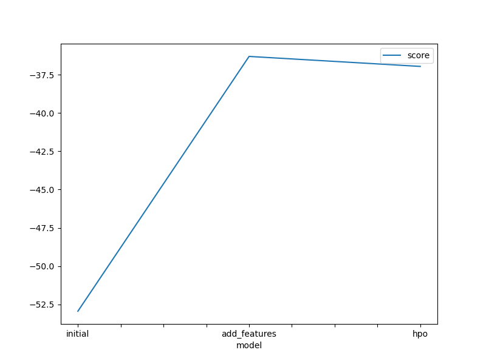
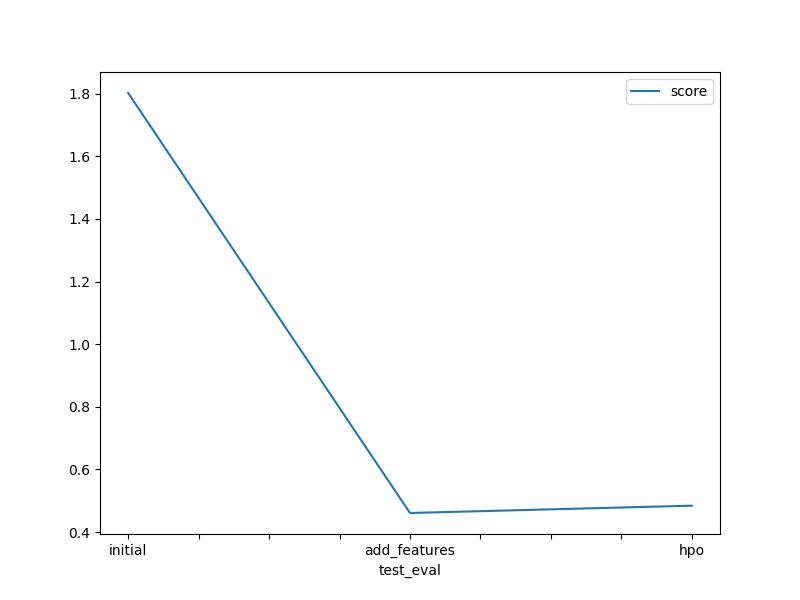

# Report: Predict Bike Sharing Demand with AutoGluon Solution
#### Abdelkarim Eljandoubi

## Initial Training
### What did you realize when you tried to submit your predictions? What changes were needed to the output of the predictor to submit your results?
During the initial training phase, I carefully inspected the predictions, aiming to identify any negative values. Fortunately, all the values turned out to be positive, negating the necessity of adjusting any values to zero before submission. Additionally, I considered converting the count column to int64 from float32. However, given that the competition's metric is root mean square logarithmic error for regression, I concluded that this conversion step was unnecessary for the output.

### What was the top ranked model that performed?
The highest-performing model, with the lowest root mean square error (RMSE), was the Weighted_Ensemble_L3 model. This model is a stacked ensemble composed of three layers of previously trained models. The stacking process was designed to achieve the highest possible validation accuracy, resulting in its top-ranked position.

## Exploratory data analysis and feature creation
### What did the exploratory analysis find and how did you add additional features?
For the Exploratory Data Analysis (EDA), I began by extracting the hour, day, month, and year from the datetime column. After this step, I dropped the original datetime column. Then, using the mean and standard deviation, I created the following features:

1. Categorization of Temperature:
Based on the mean and standard deviation of the temperature data, I categorized the temperatures into "hot," "cold," and "mild." The exact temperature ranges for each category were determined using the statistical properties of the data.

2. Categorization of Wind:
Utilizing the mean of the wind data, I created a feature that classifies the wind into "very windy" and "mild wind." This categorization is based on the calculated thresholds from the statistical properties of the wind data.

3. Categorization of Humidity:
Using the mean of the humidity data, I generated a feature that distinguishes between "very humid" and "not humid." The thresholds for this categorization were determined from the statistical properties of the humidity data.

By creating these features, the dataset now includes additional information that can be useful for further analysis and modeling. The categorization of temperature, wind, and humidity provides insights into their respective variations and patterns, potentially aiding in understanding their impact on the data.

### How much better did your model preform after adding additional features and why do you think that is?
After incorporating additional features and categorized data, my model exhibited significant performance improvement. The Kaggle score of root_mean_square_error (RMSE) decreased substantially, indicating a superior result of 0.46078, compared to the initial value of 1.80225. This enhancement can be attributed to the fact that the extra features and categorized data provided more valuable information, enabling the model to better comprehend the underlying patterns connecting the features and the target variable. Consequently, the model's ability to learn and make accurate predictions improved significantly.

## Hyper parameter tuning
### How much better did your model preform after trying different hyper parameters?
Hyperparameter tuning proved to be beneficial in certain cases; however, the overall improvement in model performance was rather limited. While some configurations yielded positive results, others had a detrimental impact on the model's performance.

### If you were given more time with this dataset, where do you think you would spend more time?
In my opinion, prioritizing feature engineering and the discovery of new features deserves more attention in the model development process. While hyperparameter tuning is undoubtedly crucial for achieving the best model performance, the results have shown that even a simple addition, such as including the "hour" feature, led to a significant increase in performance without fine-tuning the models used by autogluon.

Therefore, I believe that dedicating more time to feature engineering upfront can yield substantial gains in performance before diving into extensive hyperparameter optimization. By focusing on extracting meaningful insights from the data and creating relevant features, we can potentially uncover valuable patterns and relationships that the models can leverage to make better predictions. Once the feature engineering stage has been thoroughly explored, fine-tuning the hyperparameters can serve as a powerful refinement step to further optimize the models' performance. This sequential approach can lead to more efficient and effective model development.

### Create a table with the models you ran, the hyperparameters modified, and the kaggle score.

|model|score|NN_TORCH|GBM|CAT|XGB|FASTAI|RF|XT|KNN|
|--|--|--|--|--|--|--|--|--|--|
|initial|1.80225|default_vals|default_vals|default_vals|default_vals|default_vals|default_vals|default_vals|default_vals|
|add_features|0.46078|?default_vals|default_vals|default_vals|default_vals|default_vals|default_vals|default_vals|default_vals|
|hpo|0.48420|{'num_epochs': 500,'learning_rate': Real: lower=0.0001, upper=0.1, 'activation': ['relu', 'softrelu', 'tanh'], 'dropout_prob': Real: lower=0.0, upper=0.8}|{'extra_trees': [True, False], 'num_boost_round': Int: lower=1, upper=1000, 'num_leaves': Int: lower=1, upper=1024, 'boosting_type': ['gbdt', 'dart'], 'objective': ['l2', 'l1', 'huber', 'fair', 'poisson', 'mape', 'gamma', 'tweedie'], 'tree_learner': ['serial', 'feature', 'data', 'voting']}|{'learning_rate': Real: lower=0.0001, upper=0.1, 'depth': Int: lower=1, upper=16, 'l2_leaf_reg': Int: lower=1, upper=1024, 'loss_function': ['RMSE', 'MAE', 'Quantile:alpha=value', 'LogLinQuantile:alpha=value', 'Poisson', 'MAPE', 'Lq:q=value', 'SurvivalAft:dist=value;scale=value']}|{'learning_rate': Real: lower=0.0001, upper=1.0, 'max_depth': Int: lower=1, upper=1000, 'subsample': Real: lower=0.001, upper=1.0, 'lambda': Real: lower=0.001, upper=1000.0, 'alpha': Real: lower=0.0, upper=1000.0}|{'ps': Real: lower=0.0, upper=0.8, 'embed_p': Real: lower=0.0, upper=0.8, 'use_bn': [True, False], 'bn_final': [True, False], 'bn_cont': [True, False], 'lin_first': [True, False]}|{'n_estimators': Int: lower=1, upper=1000, 'min_samples_split': Real: lower=1e-05, upper=0.99999, 'min_samples_leaf': Real: lower=1e-05, upper=0.99999, 'max_features': ['sqrt', 'log2', None]}|{'n_estimators': Int: lower=1, upper=1000, 'min_samples_split': Real: lower=1e-05, upper=0.99999, 'min_samples_leaf': Real: lower=1e-05, upper=0.99999, 'max_features': ['sqrt', 'log2', None]}|{'n_neighbors': Int: lower=1, upper=100, 'weights': ['uniform', 'distance'], 'algorithm': ['ball_tree', 'kd_tree', 'brute'], 'p': Int: lower=1, upper=10, 'leaf_size': Int: lower=1, upper=100}|

### Create a line plot showing the top model score for the three (or more) training runs during the project.

### Create a line plot showing the top kaggle score for the three (or more) prediction submissions during the project.

## Summary
In conclusion, the project effectively demonstrated the significance of both feature engineering and hyperparameter optimization in the machine learning workflow. It revealed an iterative approach, wherein we continuously alternate between extracting new features from the provided data, conducting exploratory data analysis (EDA), and experimenting with different models using the newly engineered features. This iterative process persists until we attain a satisfactory level of validation and test errors, enhancing the model's performance step by step.
